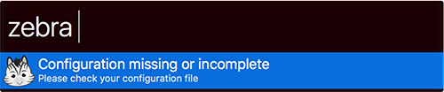

# alfred-zebra
Alfred worflow for Zebra interaction

## Configuration
Before runing this workflow, get sure you have a configuration file in your home directory: ```.alfredzebra.cfg```

It must contain the following settings:
```
[API]
url=https://your.zebra.url/api/v0
token=abcdefghijklmnopqrstuvwxyz1234567890

[WEB]
url=https://your.zebra.url
```

If the configuration file or missing, you'll get the following message


## Features
* ```alias``` Allows you to search for an activity alias and place it in the clipboard
* ```project``` Alows you to search for a project and open the associated web page

## Credits
This workflow uses [Github Octicons](https://github.com/primer/octicons) and [alfred-workflow](https://github.com/deanishe/alfred-workflow)